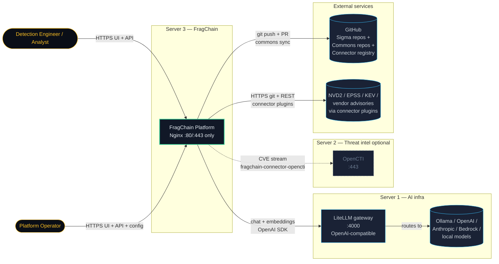
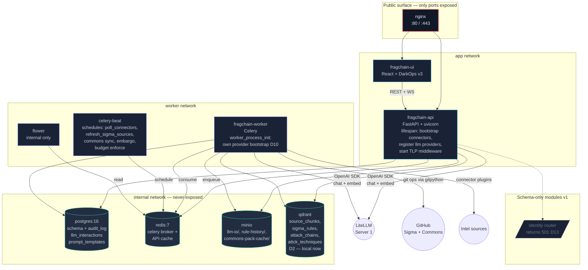
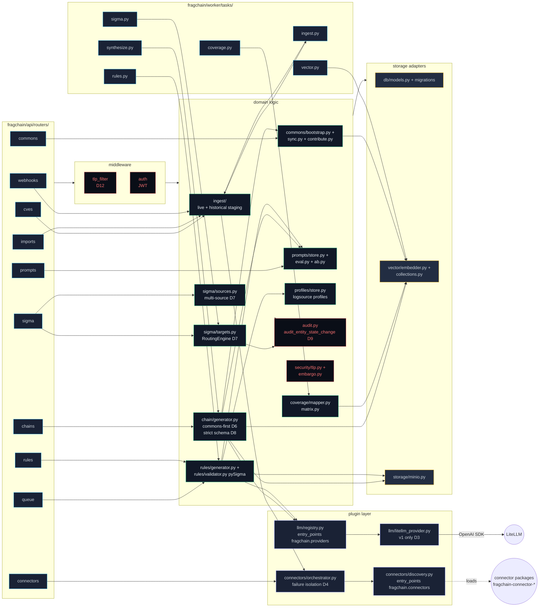
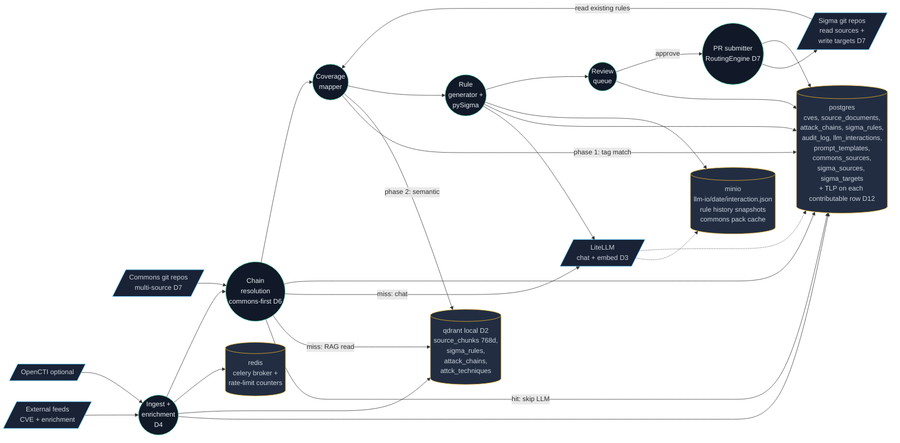
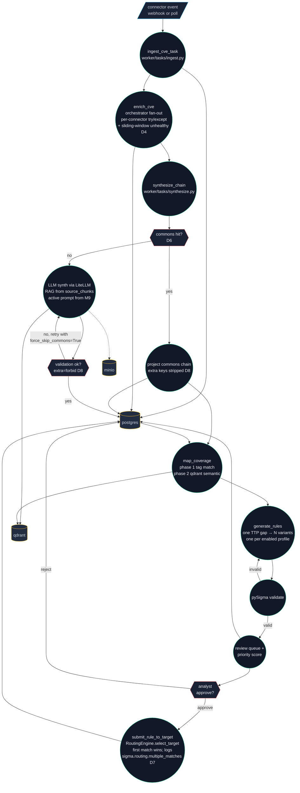
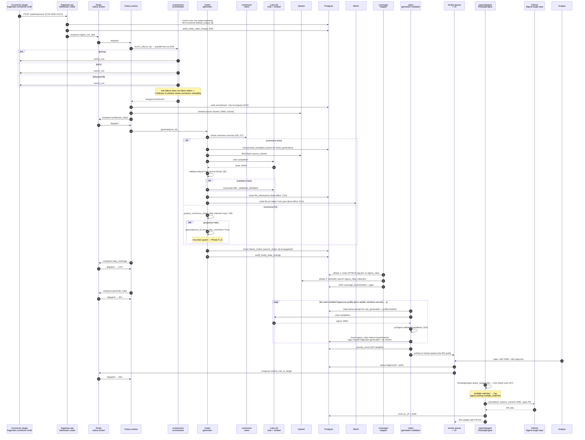
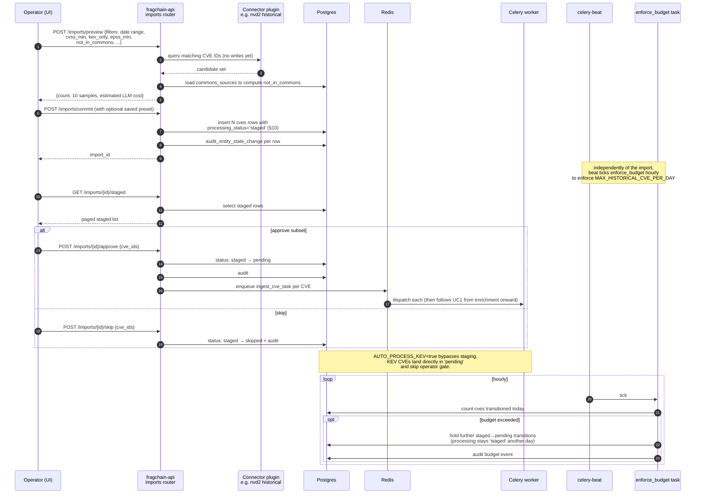
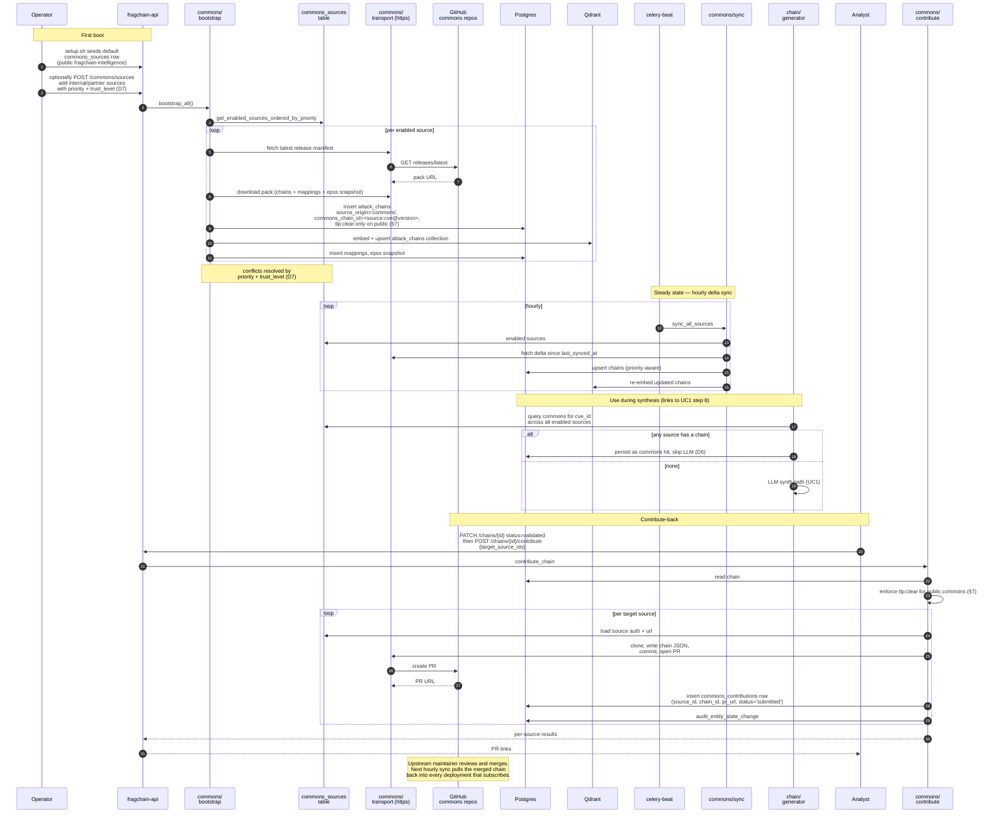

# FragChain — Platform Review Diagrams

**Audience:** engineers (review, onboarding, design discussion).
**Scope:** v1 (M1–M24 built, M25+ pending). All diagrams reflect what's in `fragchain/` today, not the future post-v1 plan.

Diagrams use Mermaid. They render natively on GitHub and in most IDE markdown previewers.

---

## 1. How to read this doc

The diagrams are layered:

| Layer | Diagram | Purpose |
|---|---|---|
| L1 | System Context | Who/what FragChain talks to. Three-server model. |
| L2 | Container view (Server 3) | Processes inside the deployment. Trust boundaries, exposed ports. |
| L3 | Component linkage | Python packages inside `fragchain/` and their call edges. |
| DFD-0 | System data flow | Where data is at rest and what crosses each store. |
| DFD-1 | Detection pipeline | The hot path: connector event → Sigma PR. |
| UC | Use cases | End-to-end sequences for the three scenarios that exercise the most surface area. |

Decisions (§2) explain *why* the shapes look the way they do — read that before the diagrams or they look arbitrary.

---

## 2. Architectural decisions (the "why")

These are the load-bearing choices. Every diagram downstream is a consequence of one of these.

| # | Decision | Why | Consequence in diagrams |
|---|---|---|---|
| D1 | **Three-server split** (LiteLLM, OpenCTI, FragChain) | Operators bring their own LLM stack and their own threat-intel platform. FragChain owns detection engineering only. | L1 has three boxes, not one. OpenCTI is optional (dashed). |
| D2 | **Qdrant moved local to Server 3** (was remote in v0) | The `fragchain_` collection prefix existed only to share a remote Qdrant cluster. Owning the vector store removes the prefix, simplifies backup, lets us version collections with the rest of the schema. | L2 shows Qdrant inside the internal network with PG/Redis/MinIO. No external port. |
| D3 | **LiteLLM is the only LLM path in v1** (`fragchain-provider-litellm`) | One OpenAI-compatible surface, every model behind it (Ollama, OpenAI, Anthropic, Bedrock). Avoids N provider SDKs in the engine; operators pick models without code changes. Direct OpenAI/Anthropic/Ollama providers are deferred to M39–M41. | L1 + UC diagrams show every LLM call going through LiteLLM. `fragchain/llm/litellm_provider.py` is the only implementation of `LLMProvider`. |
| D4 | **Connectors as entry-point plugins** (`fragchain.connectors` group) | No connector source code lives in the engine. `pip install fragchain-connector-X` + restart is the install. Failure of one connector never blocks others (per-connector try/except + sliding-window unhealthy flag in `connectors/orchestrator.py`). | L3 shows the orchestrator fanning out to N opaque connector instances. DFD-1 shows enrichment as parallel branches. |
| D5 | **LLM providers as entry-point plugins** (`fragchain.providers` group) | Mirror of D4 for LLM access. Lets us add direct providers post-v1 without touching `chain/generator.py`. | L3 shows `chain.generator` calling `llm.registry`, not LiteLLM directly. |
| D6 | **Commons-first chain resolution** | Cold-start cost dominates. If any configured commons source already has a validated chain for a CVE, we skip LLM synthesis entirely. New deployments are useful in minutes, not after thousands of LLM calls. | `chain/generator.py` does a commons check *before* an LLM call. UC1 and UC3 both branch on this. |
| D7 | **Multi-source commons + multi-target Sigma** | Public commons is one of many. Operators can layer internal + partner commons, and route generated rules to different repos (staging vs prod, Linux vs Windows). | `commons_sources` + `sigma_targets` tables. UC3 shows source priority resolution. RoutingEngine (`sigma/targets.py:267`) shown in L3. |
| D8 | **Schema strictness on LLM output, lenient on commons import** | LLM hallucinating extra fields means prompt drift — fail loud. Commons evolving its schema must not crash older engines — strip unknown keys, recurse with `force_skip_commons=True` if the row is structurally broken (Phase 5 audit L3). | UC1 shows the validation fork. `chain/schema.py` AttackChain uses `extra='forbid'`; `_project_commons_chain` strips before validation. |
| D9 | **All entity state changes go through `audit.audit_entity_state_change`** | Single source of truth for the audit log. Connector-failure isolation is meaningless if you can't reconstruct what happened. | Every UC has audit_log writes shown as side effects. |
| D10 | **Workers bootstrap their own providers** (`worker_process_init`) | Phase 5 audit L2: workers don't inherit the API's lifespan. Without this discipline, a worker process has no LLM provider registered and the pipeline silently stalls. | L2 shows the worker container with its own bootstrap arrow, separate from the API. |
| D11 | **Nginx is the only public surface** | PG/Redis/MinIO/Qdrant/Flower/Celery are on the `internal` Docker network. UI and API are on `app` but still proxied. Reduces blast radius and operator confusion. | L2 trust boundary drawn around everything except Nginx. |
| D12 | **TLP enforcement at write *and* read** | Connector declares max output TLP; chain TLP = max(explicit, max(source TLP)); rule TLP inherits from chain; middleware filters every API response. No client trust. | DFD-0 shows TLP as a property on every contributable entity; UC2 shows it on the staged CVE row. |
| D13 | **Identity is schema-only in v1** | Schema, protocol, and routers exist but enforcement does not. Every user is `tier=authenticated`, `clearance=tlp:green`. `/api/v1/identity/*` returns 501. M38 lights it up. | Identity router shown as placeholder (dashed) in L2; no identity component in UCs. |
| D14 | **Best-effort LLM I/O logging** | DB or MinIO outage must not break chat/embed. Logging failures emit `llm.io.*_failed` structlog events so ops can monitor without coupling reliability. | UC1 shows MinIO + `llm_interactions` write as side effects, not in the critical path. |

---

## 3. L1 — System Context

**Decisions driving this view:** D1, D3, D11, D13.

---

## 4. L2 — Container view (Server 3)

**Decisions driving this view:** D2, D10, D11, D13. The trust boundary is the dashed line between PUBLIC and everything else — only nginx has a published port.

---

## 5. L3 — Component linkage (inside `fragchain/`)

**Decisions driving this view:** D4, D5, D6, D7, D8, D9, D12. Note that `chain/generator.py` does not import LiteLLM — it goes through `llm/registry.py`. That's D5 in action.

---

## 6. DFD-0 — System data flow

**Trust boundary:** dashed `-.->` edges are best-effort writes (D14). The pipeline does not block on MinIO or `llm_interactions` write failures.

---

## 7. DFD-1 — Detection pipeline (the hot path)

**Two retry loops worth noticing:**

1. **LLM validation loop** (`g2` → `p4b`). If LLM output fails strict `AttackChain` validation, we re-prompt with a feedback string built from the Pydantic error (`chain/generator.py:_validation_feedback`). Bounded retries.
2. **Commons fallback loop** (`g1` → `p4b`). If projecting a commons chain fails (D8), we call `generate(cve_id, force_skip_commons=True)`. The flag is the recursion guard — fallback cannot re-find the same bad commons row (Phase 5 audit L3).

---

## 8. UC1 — Live CVE → Sigma rule PR

End-to-end golden path. Most modules participate.

**Why this matters for the review:** this is the path that exercises D3, D4, D6, D7, D8, D9, D10, D12, D14 simultaneously. If any of those decisions reverse, this sequence reshapes.

---

## 9. UC2 — Historical import with analyst gating

Operator backfills CVEs from a curated filter set. The shape is different from UC1 because there's a human gate *before* enrichment, the LLM budget is bounded, and the entry point is the UI not a webhook.

**What this exercises that UC1 doesn't:** the staging state machine (§10), the operator gate, budget enforcement (D10's worker bootstrap matters here — `enforce_budget` runs in a worker), and the saved-preset path. Failure mode worth calling out: if the preview query is slow, the operator commits a stale candidate set. The commit re-runs the filter, so the stored set is authoritative; preview is informational.

---

## 10. UC3 — Commons bootstrap + contribute-back

The differentiator (§7 of CLAUDE.md). New deployment goes from empty to useful by importing chains, then later returns validated work upstream.

**What this exercises:** the entire commons subsystem (`commons/bootstrap.py`, `commons/sync.py`, `commons/contribute.py`, `commons/client.py`, `commons/transport.py`), multi-source priority (D7), TLP-clear enforcement on public commons (D12, §7), and the loop back into UC1's chain generator (D6). The contribution path is the only place where data leaves the deployment to a configurable destination other than a Sigma target — operators reviewing trust boundaries should look here closely.

---

## 11. What is intentionally not drawn

- **UI screens.** §16 of CLAUDE.md lists the 11 screens and DarkOps v3 layout — a wireframe set belongs in a design doc, not an architecture doc.
- **Deferred modules (M25+).** Direct LLM providers (M39–M41), identity verification (M38), advanced commons signing — schema exists, components don't.
- **Per-connector internals.** Connectors are opaque to the engine by design (D4). Each connector package has its own diagram in its own repo.
- **Alembic migration graph.** Available via `alembic history` — not architecturally interesting.
- **TLP propagation truth table.** Documented in `docs/historical/FragChain_TLP_and_Identity.md` (shipped contract: CLAUDE.md §8). Diagrams show *where* it's applied, not the rules themselves.

---

## 12. Maintenance

When any decision in §2 changes, the diagram(s) listed in its "Consequence" column must be updated in the same PR. The decisions table is the load-bearing index — diagrams are derived from it.

When a new module ships, add it to L3 if it introduces new component edges, and add a UC if it introduces a new end-to-end flow operators or analysts will use.
